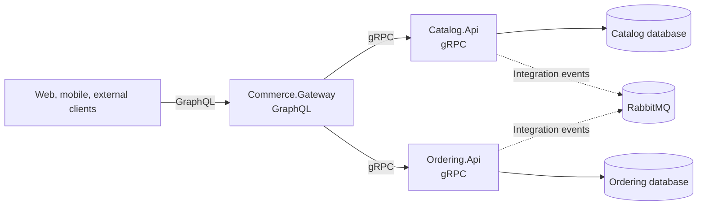

# Commerce

Commerce is a .NET microservices template for building an e-commerce platform with Clean Architecture, Domain-Driven Design, gRPC service contracts, a GraphQL gateway, and shared building blocks for cross-cutting infrastructure.

The repository is structured as a production-oriented starter template. Each service owns its application model, domain model, contracts, infrastructure, and runtime composition root.

## Architecture



## Solution Layout

```text
Commerce.slnx
src/
  BuildingBlocks/
    Commerce.BuildingBlocks.Api/
    Commerce.BuildingBlocks.Application/
    Commerce.BuildingBlocks.Contracts/
    Commerce.BuildingBlocks.Domain/
    Commerce.BuildingBlocks.Infrastructure/
  Gateways/
    Commerce.Gateway/
  Services/
    Catalog/
      Catalog.Api/
      Catalog.Application/
      Catalog.Contracts/
      Catalog.Domain/
      Catalog.Infrastructure/
    Ordering/
      Ordering.Api/
      Ordering.Application/
      Ordering.Contracts/
      Ordering.Domain/
      Ordering.Infrastructure/
tests/
```

## Technology Stack

| Concern | Technology |
| --- | --- |
| Runtime | .NET 10, ASP.NET Core |
| Gateway API | Hot Chocolate GraphQL |
| Internal RPC | gRPC, Protocol Buffers |
| Application flow | MediatR |
| Persistence | Entity Framework Core |
| Logging | Serilog |
| Messaging target | RabbitMQ |
| Architecture | Clean Architecture, DDD, service-owned contracts |

## Services

### Commerce.Gateway

The gateway is the public client-facing API. It exposes GraphQL queries and mutations and calls downstream services through generated gRPC clients.

Current Catalog GraphQL capabilities:

- `productById(productId: UUID!)`
- `createProduct(input: CreateProductInput!)`
- `stockItemByProductId(productId: UUID!)`
- `createStockItem(input: CreateStockItemInput!)`

### Catalog

Catalog owns product and inventory behavior.

Current gRPC contracts:

- `catalog/products/product_service.proto`
- `catalog/products/product_messages.proto`
- `catalog/inventory/inventory_service.proto`
- `catalog/inventory/inventory_messages.proto`

Current application use cases:

- Create product
- Get product by id
- Create stock item
- Get stock item by product id

### Ordering

Ordering is scaffolded with the same project boundaries and is ready for order use cases, contracts, persistence, and messaging integration.

## Building Blocks

Shared packages are split by responsibility:

- `Commerce.BuildingBlocks.Domain`: results, errors, entities, domain events.
- `Commerce.BuildingBlocks.Application`: application abstractions such as unit of work.
- `Commerce.BuildingBlocks.Api`: API transport helpers, including gRPC error mapping.
- `Commerce.BuildingBlocks.Contracts`: shared contract runtime dependencies for generated protobuf contracts.
- `Commerce.BuildingBlocks.Infrastructure`: logging and infrastructure helpers.

Application error codes are created inside the owning service, propagated through gRPC trailers, and mapped by the gateway into GraphQL errors. The gateway should translate transport failures and data shapes only; it should not own downstream service business rules.

## Prerequisites

- .NET 10 SDK
- SQL Server or the configured Catalog database provider
- Docker Desktop when RabbitMQ or containerized dependencies are added
- Visual Studio, Rider, or Visual Studio Code

## Configuration

Gateway configuration must include downstream gRPC addresses:

```json
{
  "GrpcClients": {
    "Catalog": "https://localhost:7001"
  }
}
```

Catalog API supports a local MediatR license key through an ignored local settings file:

```json
{
  "MediatR": {
    "LicenseKey": "PASTE_MEDIATR_LICENSE_KEY_HERE"
  }
}
```

Use `appsettings.Local.json`, user secrets, or environment variables for local secrets. Do not commit license keys, connection strings, tokens, passwords, or private certificates.

## Build

```bash
dotnet restore Commerce.slnx
dotnet build Commerce.slnx
```

## Run Locally

Run each process in a separate terminal:

```bash
dotnet run --project src/Services/Catalog/Catalog.Api
dotnet run --project src/Services/Ordering/Ordering.Api
dotnet run --project src/Gateways/Commerce.Gateway
```

The gateway exposes GraphQL at:

```text
http://localhost:5155/graphql
```

Use the actual port from the running application output if your local launch profile uses a different URL.

## GraphQL Examples

Create a product:

```json
{
  "query": "mutation CreateProduct($input: CreateProductInput!) { createProduct(input: $input) { productId } }",
  "variables": {
    "input": {
      "sku": "SKU-001",
      "name": "Keyboard",
      "description": "Mechanical keyboard",
      "priceAmount": 120,
      "priceCurrency": "USD"
    }
  }
}
```

Get a product:

```json
{
  "query": "query GetProductById($productId: UUID!) { productById(productId: $productId) { id sku name description priceAmount priceCurrency status } }",
  "variables": {
    "productId": "9f4f6d2b-8a2d-4e4a-9e8f-2f4a1c7b6d91"
  }
}
```

Create a stock item:

```json
{
  "query": "mutation CreateStockItem($input: CreateStockItemInput!) { createStockItem(input: $input) { productId } }",
  "variables": {
    "input": {
      "productId": "9f4f6d2b-8a2d-4e4a-9e8f-2f4a1c7b6d91"
    }
  }
}
```

Get a stock item:

```json
{
  "query": "query GetStockItemByProductId($productId: UUID!) { stockItemByProductId(productId: $productId) { productId quantityOnHand reservedQuantity availableQuantity } }",
  "variables": {
    "productId": "9f4f6d2b-8a2d-4e4a-9e8f-2f4a1c7b6d91"
  }
}
```

## Contract Generation

Generated gRPC C# code is produced by the protobuf tooling during restore or build.

After changing `.proto` files, run:

```bash
dotnet clean Commerce.slnx
dotnet restore Commerce.slnx
dotnet build Commerce.slnx
```

## Architecture Rules

- Gateway projects do not contain domain logic or direct database access.
- API projects map transport contracts to application use cases.
- Application projects orchestrate use cases and depend on domain abstractions.
- Domain projects contain business rules and do not reference infrastructure, ASP.NET Core, EF Core, GraphQL, or gRPC implementations.
- Infrastructure projects implement persistence, messaging, storage, and external service access.
- Contracts projects contain `.proto` files and public integration contracts, not domain entities.
- Each service owns its database schema and migrations.
- Shared code belongs in BuildingBlocks only when it is service-agnostic.

## Error Handling

Service use cases return `Result` values with centralized error definitions, for example `ProductErrors`, `InventoryErrors`, and `MoneyErrors`.

The gRPC API layer maps application errors to `RpcException` and propagates the application error code in trailers. The GraphQL gateway reads that code and exposes it through GraphQL error extensions.

This keeps error ownership inside the service that owns the business capability.

## Commit Convention

Use Conventional Commits:

```text
feat(catalog): add product creation command
feat(graphql): expose catalog product queries
fix(grpc): propagate application error codes
docs(readme): document local development workflow
```

Preferred scopes include:

- `catalog`
- `ordering`
- `gateway`
- `grpc`
- `graphql`
- `contracts`
- `inventory`
- `messaging`
- `persistence`
- `docker`
- `observability`

## Roadmap

- Complete Ordering domain and application use cases.
- Add RabbitMQ integration events with outbox and inbox processing.
- Add database migrations per service.
- Add health checks and OpenTelemetry.
- Add authentication and authorization at the gateway.
- Add unit, integration, contract, and architecture tests.
- Add Docker Compose for local infrastructure.

## License

No license has been selected yet. Add a license before publishing or accepting external contributions.
