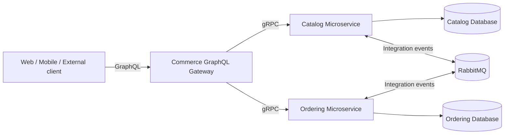
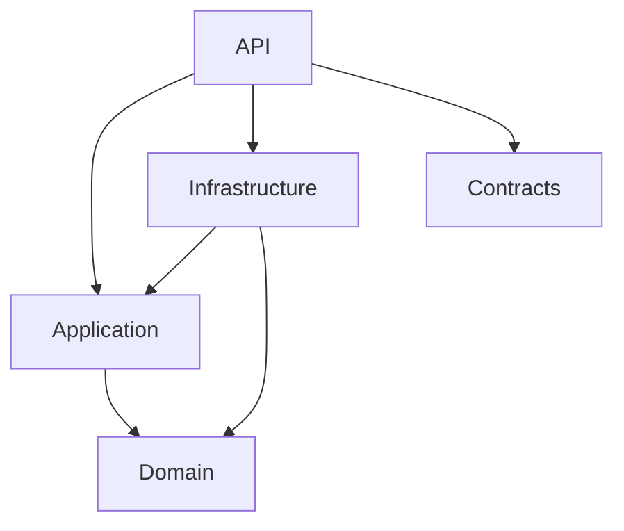

# Commerce Microservices Template

A learning-first .NET solution for exploring how an e-commerce system can evolve from a small scaffold into a microservices architecture using gRPC, GraphQL, Clean Architecture, Domain-Driven Design (DDD), and RabbitMQ.

> This repository is intentionally a scaffold, not a finished production system. The application code is kept minimal so each architectural decision can be implemented and learned step by step.

## Current status

The repository currently contains:

- A .NET 10 solution using the `.slnx` format.
- A `Catalog` service split into API, Application, Domain, Infrastructure, and Contracts projects.
- An `Ordering` service with the same Clean Architecture boundaries.
- A `Commerce.Gateway` project prepared to become the public GraphQL entry point.
- Starter gRPC services generated by the standard ASP.NET Core template.

The following capabilities are architectural goals and are not implemented yet:

- Business-focused Catalog and Ordering aggregates.
- Service-to-service gRPC contracts.
- GraphQL schema and resolvers at the gateway.
- RabbitMQ integration events and consumers.
- Database persistence, migrations, observability, resilience, and authentication.

## Target architecture



The intended communication model is:

- **GraphQL** for client-facing queries and mutations through a single gateway.
- **gRPC** for synchronous communication between trusted internal services.
- **RabbitMQ** for asynchronous integration events and eventual consistency.
- **One database per service** so each bounded context owns its data and behavior.

## Technology direction

| Area | Technology / approach | Status |
| --- | --- | --- |
| Runtime | .NET 10, ASP.NET Core | Scaffolded |
| Architecture | Microservices, Clean Architecture | Project boundaries scaffolded |
| Domain modeling | Domain-Driven Design | To be implemented |
| Internal synchronous communication | gRPC / Protocol Buffers | Starter sample only |
| Client API | GraphQL gateway | To be implemented |
| Messaging | RabbitMQ | To be implemented |
| Persistence | Database per service | To be selected |
| Testing | Unit, integration, contract, architecture tests | To be implemented |
| Deployment | Docker and Docker Compose | To be implemented |
| Observability | OpenTelemetry, structured logs, health checks | To be implemented |

## Repository structure

```text
.
├── Commerce.slnx
├── src
│   ├── Gateways
│   │   └── Commerce.Gateway
│   └── Services
│       ├── Catalog
│       │   ├── Catalog.Api
│       │   ├── Catalog.Application
│       │   ├── Catalog.Contracts
│       │   ├── Catalog.Domain
│       │   └── Catalog.Infrastructure
│       └── Ordering
│           ├── Ordering.Api
│           ├── Ordering.Application
│           ├── Ordering.Contracts
│           ├── Ordering.Domain
│           └── Ordering.Infrastructure
└── tests
```

## Clean Architecture boundaries

Each microservice follows the same dependency direction:



### Domain

Contains business concepts and rules: aggregates, entities, value objects, domain events, specifications, and domain services. It should not depend on databases, message brokers, web frameworks, or another service.

### Application

Contains use cases and orchestration: commands, queries, handlers, ports/interfaces, validation, and transaction boundaries. It depends on the Domain layer, while infrastructure details are supplied through interfaces.

### Infrastructure

Implements technical concerns such as repositories, database access, outbox storage, RabbitMQ publishers/consumers, caching, and third-party integrations.

### API

Is the service composition root. It configures dependency injection, middleware, gRPC endpoints, authentication, health checks, and maps transport models to application use cases.

### Contracts

Contains the public messages a service deliberately exposes, such as Protocol Buffer definitions and integration-event contracts. Avoid leaking internal domain entities through this project.

## Prerequisites

- [.NET 10 SDK](https://dotnet.microsoft.com/download/dotnet/10.0)
- An IDE such as Visual Studio, JetBrains Rider, or Visual Studio Code
- Docker Desktop for the later RabbitMQ and database exercises

## Build the scaffold

```bash
dotnet restore Commerce.slnx
dotnet build Commerce.slnx
```

Run the current starter projects separately:

```bash
dotnet run --project src/Services/Catalog/Catalog.Api
dotnet run --project src/Services/Ordering/Ordering.Api
dotnet run --project src/Gateways/Commerce.Gateway
```

The Catalog and Ordering APIs currently expose the default `Greeter` gRPC sample. The gateway currently exposes a minimal HTTP endpoint. Replace these samples as you work through the roadmap below.

## Suggested learning roadmap

1. **Model the Catalog bounded context**
   - Create a `Product` aggregate and value objects.
   - Add commands and queries without referencing Infrastructure from Application.
   - Implement an in-memory repository before introducing a database.

2. **Design a real gRPC contract**
   - Replace `greet.proto` with product queries.
   - Keep protobuf messages in `Catalog.Contracts`.
   - Call Catalog from the gateway and handle deadlines, cancellation, and failures.

3. **Add the GraphQL gateway**
   - Introduce a GraphQL server such as Hot Chocolate.
   - Implement query resolvers backed by gRPC clients.
   - Add mutations only after the application use cases are clear.

4. **Model the Ordering bounded context**
   - Introduce `Order`, `OrderItem`, money, and order-status rules.
   - Keep invariants inside the aggregate instead of API controllers or handlers.

5. **Introduce RabbitMQ**
   - Publish an `OrderSubmitted` integration event.
   - Add idempotent consumers and retry/dead-letter behavior.
   - Study the transactional outbox pattern before publishing directly after a database write.

6. **Add persistence per service**
   - Choose storage based on each bounded context rather than sharing one schema.
   - Keep migrations owned and deployed by the service that owns the data.

7. **Harden the system**
   - Add unit, integration, contract, and architecture tests.
   - Add health checks, OpenTelemetry, structured logging, authentication, and authorization.
   - Containerize the services and create a local Docker Compose environment.

## Design principles

- Model business behavior before choosing infrastructure.
- Keep bounded contexts autonomous and avoid shared domain models.
- Prefer explicit contracts and backward-compatible message evolution.
- Use synchronous calls only when the caller needs an immediate answer.
- Use asynchronous events for facts that other services may react to independently.
- Expect partial failure: add timeouts, retries with care, idempotency, and observability.
- Start simple. Add patterns such as CQRS, event sourcing, or sagas only when the problem earns them.

## Branch and commit conventions

A lightweight convention is enough while learning:

- Branches: `feature/catalog-product`, `feature/graphql-gateway`, `chore/docker-compose`
- Commits: `feat(catalog): add product aggregate`, `docs: explain messaging flow`

Small commits make architectural experiments easier to understand and reverse.

## Contributing

This is a learning template. Open an issue before making a large architectural change, explain the trade-offs, and keep pull requests focused on one learning objective.

## License

No license has been selected yet. Add one before redistributing or accepting external contributions.
